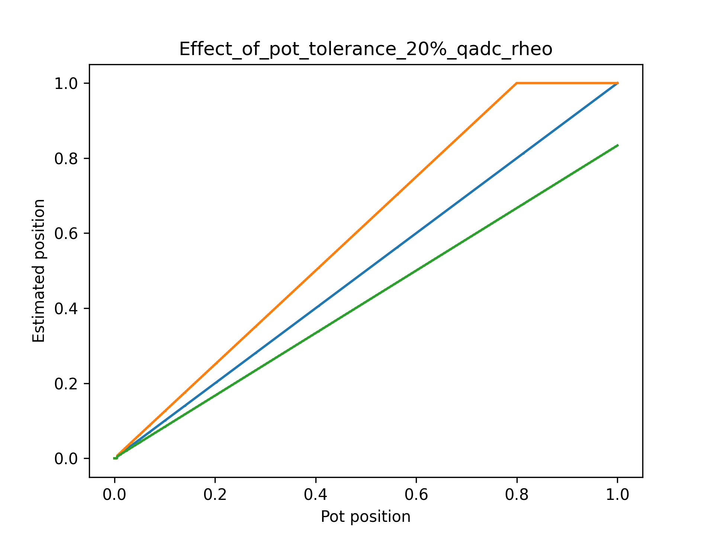

Quasi ADC Potentiometer Reader
==============================

Introduction
------------

Xcore.ai devices offer an inexpensive way to read the value of a variable resistor (rheostat) or a potentiometer without the need for a dedicated external ADC component. The performance may be suitable for applications such as reading the position of an analog slider can may then be converted in to a gain control. Resolutions in excess of eight bits can be achieved which is adequate for many control applications.

The Quasi ADC (QADC) relies on the fact that the input threshold for the xcore IO is very stable at around 1.15 V for a Vddio of 3.3 V. By charging a capacitor to the full rail and discharging it through a resistor, the RC time constant can be determined. If you know the value of C, then you can read R by timing the transition. As long as VDDIO remains constant between the charge and discharge cycles then the IO voltage component will cancel out.

The xcore offers precise timing of transitions of IO using port logic (in this case 10 ns resolution) so a reasonable accuracy ADC can be implemented using just a couple of additional passive components and some software.

Two schemes are offered which have different pros and cons depending on the application. The table below summarises the approaches.

.. _fig_src_filters:
.. list-table:: QADC Comparison
     :widths: 30 40 40
     :header-rows: 1

     * - Item
       - Rheostat reader
       - Potential reader
     * - Minimum scale
       - 0% + small dead zone
       - 0% + small dead zone
     * - Maximum scale
       - Dependent on end to end track tolerance
       - 100% + small dead zone
     * - Possible discontinuity or dead zone midway
       - No
       - Yes at 35% travel if tolerance of components poor
     * - Typical max counts
       - ~10000
       - ~10000
     * - Required VDDIO tolerance
       - 5%
       - 5%
     * - Typical minimum conversion time per channel
       - ~0.2 - 0.5 milliseconds
       - ~0.2 - 0.5 milliseconds
     * - Supported port widths
       - 1 bit ports only
       - Any port width. Arrays of ports must be of same type.
     * - Number of channels
       - Limited by port count only
       - Limited by port count only
     * - Typical ENOBs post filtering 
       - 8+
       - 8+
     * - Requires 5 % capacitor (eg C0G)
       - Yes
       - Yes
     * - Requires calibration
       - Yes, if passive components worse than 10 % tolerance. Will improve full scale estimated position.
       - Normally OK up to around 20 % passive tolerance. 10% will improve linearity.
     * - Linearity
       - Good
       - Reasonable, depending on passive tolerance
     * - Monotonic
       - Yes
       - Yes
     * - Memory usage (8 bit, two channels)
       - 3 kB
       - 5 kB

Noise is always a concern in the analog domain and the QADC is no different. In particular power supply stability and coupled signals (such as running the QADC input close to a digital IO) should be considered when designing the circuitry. Since the QADC relies on continuously charging and discharging a capacitor it is also recommended that any analog supplies on the board are separated from the xcore digital supply to avoid any noise from the QADC conversion process being coupled to places where it would unwelcome.

Rheostat Reader
...............

The rheostat reader uses just two terminals of a potentiometer and treats it as variable resistor (rheostat). The scheme works as follows:

- Charge capacitor via the port by driving a `one` and waiting for at least 5 maximum RC charge periods.
- Make IO open circuit which initiates the discharge. Take the port timer at this point. Setup a ``pinseq(0)`` event on the port to capture the transition to zero.
- Wait for transition to a read `zero` and take the stop timestamp.
- Set the port to high impedance because there is no point in fully discharging the capacitor.
- Calculate difference the difference in time.
- Post process value to reduce noise and improve linearity.

The rheostat reader currently supports only arrays of 1 bit ports.

.. _fig_qadc_rheo_schem:

   QADC Rheostat Circuit

The rheostat reader offers excellent linearity however it suffers from full scale setting accuracy if the passive components have large tolerances. This may result, for example with 20% tolerances, in full scale being read at 80% (and beyond) of the travel or only 80% being registered at the end of the travel. See the :ref:`effect of passive components <effect_passives>` section for more details.

.. _fig_qadc_rheo_ticks:

   QADC Rheostat Timer Ticks vs Position

.. note::
    If the QADC input pin is left disconnected you will see a full scale output.

Potential Reader
................

The potential reader uses all three terminals of a potentiometer where the track end terminals are connected between ground and Vddio. Depending on the initial reading of the IO pin, the QADC either charges the capacitor to Vddio or discharges it ground and then times the transition through the threshold point to the potential set by the potentiometer, via the equivalent resistance of the potentiometer. The equivalent resistance of the potentiometer is the parallel of the upper and lower sections between the wiper and the end terminals.

Due to the reasonably complex calculation required to determine the estimated position from the transition time, which includes several precision multiplies, divides and a logarithm, a look up table (LUT) is pre-calculated at initialisation to make the conversion step more CPU efficient.

.. _fig_qadc_pot_ticks:

   QADC Potentiometer Timer Ticks vs Position

.. _fig_qadc_pot_par_res:
.. figure:: images/qadc_pot_par_res.pdf
   :width: 80%

   QADC Potentiometer Equivalent Resistance vs Position for 25 kOhm Component

The scheme works as follows:

- Read the current port value to see if voltage of the potentiometer is above or below threshold.
- Set the inverse port value and wait to charge capacitor fully to the opposite supply rail.
- Set the port to high impedance and take a timestamp.
- Take a timestamp when voltage crosses threshold.
- Use the lookup table to calculate the start voltage.
- Post process value to reduce noise and improve linearity.

The rheostat reader currently supports arrays of any port width with the proviso that all ports are the same width.

The potential reader offers good performance and is less susceptible to component tolerances due to the mathematics of using a parallel resistor network and the logarithm used. It will always achieve zero and full scale however if tolerances are too large then it may show worse non-linearity than the rheostat reader and, in particular, around the 35% setting point which corresponds the threshold voltage of the IO. It does however always remain monotonic in operation. See the :ref:`effect of passive components <effect_passives>` section for more details.

A small amount of noise is present when taking readings close to the threshold point. A moving average filter is typically used and so these non-linearities are reduced in practice and more than eight bits of resolution can easily be achieved. 

.. _fig_qadc_pot_schem:

   QADC Potentiometer Circuit

.. _fig_qadc_pot_equiv_schem:

   QADC Potentiometer Equivalent Circuit

.. note::
    If the QADC input pin is left disconnected you will likely see a value of 35 % of full scale for the 1b port version and a value of close to zero for the wide port version.

Post Processing
---------------

Both QADC schemes benefit from post processing of the raw measured transition time to improve performance.

.. _fig_post_proc:

   QADC Post Processing Steps

The included post processing steps are as follows:

Zero Offset Removal
...................

There is a minimum time the architecture can setup a transition event on the port and the circuitry discharge a capacitor. The first post processing stage is therefore to remove this offset so that the zero scale (and full scale in the case of the potentiometer scheme) can be read as correctly. See the :ref:`QADC Tuning <tuning>` section for more details on setting this value.

Moving Average Filter
.....................

The moving average filter (sometimes know as a Boxcar FIR) helps filter out noise from the raw signal. It uses the conversion of history and takes the average value of the conversion and effectively low-pass filters the signal. One filter is provided per channel and the depth of the filter is configurable. A typical depth of 32 has been found to provide a good performance. Due to the low pass effect very long filters will reduce the response time of the QADC.

Scaling
.......

Scaling typically means reducing the raw resolution of the ADC from 12 - 13 bits and quantising it to a typical bit resolution such at 8, 9 or 10 bits. This provides a signal which has a know range, for example, 0 - 511 for the 9 bit case. This step also offers the possibility of calibration where the tolerance of the passive components may affect the estimated position of the input.

Hysteresis
..........

Even after filtering it may still be possible to see some small noise signal depending on configuration. This may also be exaggerated due to the natural quantisation to a digital value by the QADC, particularly if the setting is close to a transition point. By adding a small hysteresis (say a value of one or two) additional stability can be achieved at the cost of a very small dead zone at the last position. This may desirable if the QADC output is controlling a parameter that may be noticeable if it hunts between one or more positions. The hysteresis is configurable and may be removed completely if needed by setting to 0.

.. _effect_passives:

Comparing the Effect of Passive Component Tolerance on Both Schemes
-------------------------------------------------------------------

Both schemes offered will work very well when the overall passive component tolerances are good (e.g. 5%). However typical variable resistors/potentiometers are designed to produce good relative resistances rather than absolute resistances and often the end-to-end resistance tolerance can be as high as 20%. The QADC relies more on absolute resistances, particularly the rheostat approach.

When passive component tolerances are poor we see differing effects on the real-life transfer curves of ``actual position`` versus ``estimated position`` depending on the scheme used.

For the ``Rheostat`` approach we see the good linearity and zero scale performance is always retained however full scale is directly affected. For example, if the resistor tolerance is 20% too low then the time constant will be smaller than expected and the maximum setting that can be achieved is 80% even at full travel (orange curve). This can be seen in :ref:`the rheostat transfer curve <fig_qadc_rheo_tol>`. If the resistor tolerance is 20% too high then full scale will be achieved at 80% travel and the last 20% of travel will give the same reading of full scale (green curve). 

The small step close to zero is caused by the QADC not being able to charge the capacitor past the threshold voltage at low setting due to the required series resistor.

If a manufacturing test is an option to calibrate the component values then this is likely the best approach to adopt. 

.. _fig_qadc_rheo_tol:

   QADC Rheostat Effect of 20% Tolerance on Transfer Curve

The `Potentiometer` approach is more tolerant to the overall end to end resistance since it's operation also relies on the starting potential as well as the equivalent series resistance at any given setting, which itself is a function of the end-to-end track resistance. Even when tolerance is 20% out the end positions will always achieve zero and full scale however linearity is slightly degraded and a small flat spot or inflection point may be seen at around 1/3 of the travel. 

The curve will always remain monotonic increasing however the effect of noise (present in all ADCs) and the use of post processing (filtering and hysteresis)  reduces the real life affect to a couple of percent of the travel, to a point where it may be unnoticeable.

Where the potentiometer end to end resistance is higher than set in the model, flat spot effect will be seen due to a higher than expected RC constant when the potentiometer is near to the GPIO input threshold voltage. Where the potentiometer end to end resistance is lower than set in the model, the inflection effect will be see due to the RC time constant being shorter than expected. This can be seen in :ref:`the potentiometer transfer curve <fig_qadc_pot_tol>`.

The small steps in the transfer curve close to zero and full scale settings are caused by the QADC not being able to charge the capacitor past the threshold voltage due to the potential divider effect of the series resistor and the potentiometer equivalent series resistance.

.. note::
    Overall, it is recommended to use the `Potentiometer` approach in cases where the potentiometer tolerance is between 10% and 20% and including a manufacturing calibration step is not practical.

.. _fig_qadc_pot_tol:

   QADC Potentiometer Effect of 20% Tolerance on Transfer Curve

This theoretical behavior has been verified as shown in the :ref:`Hardware Characterisation <characterise>` section of this document.

.. _passive_selection:

Passive Component Selection
---------------------------

There are three components to consider when building one channel of QADC.

The variable resistor should be typically in the order of 20 - 50 kOhms. A lower value such as 10 kOhms may be used but it will either reduce the accuracy of the QADC slightly due to the increasing effect of the (required) series resistor and a reduced count or require the inclusion a larger capacitor to compensate which will increase power consumption due to greater charge/discharge amounts. The practical effect of this will also to be to increase the step sizes seen at the end positions of the transfer curves.

Choosing a value significantly of 100 kOhms or above may also decrease performance due to PCB parasitics or IO input leakage affecting the accuracy.

The capacitor value should by typically around 2 - 5 nF with the same trade-offs being seen as that of the variable resistor. A larger value is acceptable but it will increase the conversion time. A smaller value will increase noise and the effects of PCB stray capacitance may start to emerge. A 5 % tolerance C0G or similar capacitor is recommended although any type with good voltage vs. capacitance characteristics and 5 % tolerance is acceptable. Typical X7R decoupling capacitors are not ideal due to their negative voltage coefficient of capacitance which means the capacitance varies based on voltage.

The series resistor value is a compromise. Ideally it would set to a low value to reduce the small step effects in the transfer curve however this increases the current draw on the IO pin when the slider is close to end settings, which is undesirable and may cause noise. Typically a value of 1 % of the variable resistor value maximum is applicable with a minimum being around 330 ohms to limit the inrush current to the capacitor. Smaller values may cause unwanted EMI when the IO pin charges the capacitor although the IO drive settings are set to the minimum of 2 mA in QADC to minimise this effect.

Typical values recommended are:

.. list-table:: Recommended passive values for QADC
   :widths: 20 25 25 25
   :header-rows: 1

   * - Capacitor value
     - Potentiometer value
     - Series resistor value
     - Conversion cycle time
   * - 2200 pF 5%
     - 47 kOhms, 20 % or better (10 % ideally)
     - 470 Ohms, 5 % or better
     - 1 millisecond (= 100,000 10 MHz timer ticks)

.. _tuning:

QADC Tuning
-----------

Once the :ref:`passive components <passive_selection>`  have been selected then you can configure your QADC. Both schemes share a common configuration of type ``qadc_config_t`` as shown in the :ref:`API section <api>`.

.. note::
    It is highly recommended to prototype the values and test the configuration before deployment. There are natural sources of error in any analog scheme and these should be evaluated by the user.

The ``qadc_config_t`` configuration can be initialised (using C in this example rather than XC) as follows:

.. literalinclude:: ../../tests/qadc_c_interface/src/main.c
   :start-at: const qadc_config_t adc_config
   :end-at: .port_time_offset =

The passive component selection should be directly inputted into the structure and nominal values of ``3.3`` and ``1.15`` used for the IO voltage and threshold voltage. If the IO voltage is known to be say 5 % lower than 3.3 then please scale both values accordingly (e.g. 3.135 and 1.0925).

The final three settings require some thought and are described below.

How to set auto_scale
.....................

Autoscale works by measuring the time taken to reach the conversion result. If it takes longer than expected (full scale for rheostat or 35% setting for potentiometer) then it trims the max value so that the reading can be made more accurate during the following runtime of the QADC (until reset).

It can help cases where the RC constant is larger than expected however it is not possible to detect where the RC constant is smaller than expected. 
It may be helpful to use this setting if you choose to set the RC a little higher than nominal to achieve better linearity. However it must be noted that the first full transition of QADC will behave slightly differently to subsequent transitions if this is enabled.

Set this value to 0 by default.

How to set convert_interval_ticks
.................................

This parameter is only relevant to ``continuous`` mode where a task cycles through the QADCs. It sets the total period per conversion which includes charging the capacitor, measuring the discharge periods and an idle time at the end to allow the capacitor to reach it's natural voltage governed by the external passives.

The QADC will check the set values and automatically assert if the following condition is not met::

    convert_interval_ticks > (max_charge_period_ticks + max_disch_ticks * 2)

The ``max_charge_period_ticks`` is nominally 5 times the RC constant and ``max_disch_ticks`` is calculated by the code as the maximum time to reach the threshold voltage when the IO goes high impedance. This is doubled to allow for some idle time and provides a safe setting. A typical setting will be in the region of one millisecond, depending on passive value selection.

In ``single shot`` mode the setting is ignore because the API takes the correct amount of time to account for all required steps.

How to set port_time_offset
...........................

The time it takes the QADC code to respond is finite. So when, for example, the rheostat is set to minimum or the potentiometer is set to minimum or maximum, the IO event indicating end of conversion should fire immediately. Due to the measured time being finite (but small) due to the number of CPU cycles needed to register the port event, an offset is required. This value is in 10 nanosecond timer ticks. 

If this number is too small, it will result in full scale not being achieved. If it is too large, then there will exist larger dead zones at full scale (and zero scale for the potentiometer). Hence it is recommended to evaluate this setting before deployment.

The value needed will be proportional to the thread speed in your system which is typically ``core frequency / 5`` maximum and minimum ``core frequency / n`` where n is the maximum number of threads used on the QADC xcore tile. 

If the thread speed is variable then it is recommended to tune this for the *slowest* thread speed and accept a small dead-spot. This ensures full scale is always achievable.

.. list-table:: Recommended ``port_time_offset`` values for QADC
   :widths: 25 25 25
   :header-rows: 1

   * - Thread speed
     - 75 MHz
     - 120 MHz
   * - Rheostat setting
     - XXX
     - XXX
   * - Potentiometer setting
     - 56
     - 36

QADC Usage
----------

There are three main modes of operation for the QADC.

Continuous Modes
................

If many channels are needed and ``continuous`` updates are required then it is convenient to run a task which performs background continuous conversion and associated filtering. This requires a dedicated hardware thread.

The values may then be read by the application either:

   - Over a channel (application on same or different tile from the QADC) or 
   - By shared memory (same tile only) using the adc_xxx_state.results member which is a pointer to an array of ``unit16_t`` result values.

The examples included in `the QADC repo <https://github.com/xmos/lib_qadc>`_ under ``/examples`` show both continuous modes in use.

Single Shot Mode
................

A ``single shot`` API is also available which allows a single conversion to be performed by calling a function. Note that the function call is blocking and will return only when the conversion is complete. This will typically take a few hundred microseconds for the recommended passive component selection.

When infrequent conversions are made using ``single shot`` mode it is recommended to reduce the depth of the moving average filter down to the actual number conversions performed for each desired QADC value.

The examples included in `the QADC repo <https://github.com/xmos/lib_qadc>`_ under ``/examples`` show the single shot mode in use.

.. _api:

QADC API
--------

Common API
..........

Common items for both types of QADC are shown here.

.. note::
    Depending on whether QADC is called from an XC program with a par{} or from C with PAR_JOBS()
    extra hardware setup may be needed. If using PAR_JOBS() please call qadc_pre_init_c() before 
    QADC initialisation.

See the :ref:`QADC Tuning <tuning>` section for more details on setting these values.

.. doxygenstruct:: qadc_config_t
    :members:

.. doxygengroup:: lib_qadc_common
   :content-only:

QADC Rheostat API
.................

Specific items for the Rheostat QADC are shown here.

.. doxygenstruct:: qadc_rheo_state_t

.. doxygengroup:: lib_qadc_rheo_reader
   :content-only:

QADC Potentiometer API
......................

Specific items for the Potentiometer QADC are shown here.

.. doxygenstruct:: qadc_pot_state_t

.. doxygengroup:: lib_qadc_pot_reader
   :content-only:

Building and running the examples
---------------------------------

The examples are designed to run on the ``XK-EVK-XU316`` (XCORE-AI-EXPLORER) kit although any xcore.ai hardware will work (please adjust the QADC ports accordingly).

Ensure a correctly configured installation of the XMOS tools and open an XTC command shell. Please check that the XMOS tools are correctly
sourced by running the following command::

    $ xcc
    xcc: no input files

.. note::
    Instructions for installing and configuring the XMOS tools appear on `the XMOS web site <https://www.xmos.ai/software-tools/>`_.

Clone the lib_qadc repository::

    git clone git@github.com:xmos/lib_qadc.git
    cd lib_qadc

Next ensure you have adjusted the relevant paramters for your design:

.. literalinclude:: ../../examples/pot_reader/src/main.xc
   :start-at: #define NUM_ADC
   :end-at: on tile[1]: port p_adc[]

.. literalinclude:: ../../examples/pot_reader/src/main.xc
   :start-at: const unsigned capacitor_pf
   :end-at: const unsigned convert_interval_ticks

Run the following commands in the lib_sw_pll/examples directory to build the firmware::

    cmake -B build -G "Unix Makefiles"
    xmake -j -C build

To run the example firmware, first connect the required passive circuitry to the QADC input pins and the run one of the following examples as appropriate::

    xrun --xscope pot_reader/bin/SINGLE/qadc_pot_example_SINGLE.xe
    xrun --xscope pot_reader/bin/CONTINUOUS_CHAN/qadc_pot_example_CONTINUOUS_CHAN.xe
    xrun --xscope pot_reader/bin/CONTINUOUS_MEM/qadc_pot_example_CONTINUOUS_MEM.xe
    xrun --xscope rheo_reader/SINGLE/bin/qadc_rheo_example_SINGLE.xe
    xrun --xscope rheo_reader/CONTINUOUS_CHAN/bin/qadc_rheo_example_CONTINUOUS_CHAN.xe
    xrun --xscope rheo_reader/CONTINUOUS_MEM/bin/qadc_rheo_example_CONTINUOUS_MEM.xe

In each case the converted QADC values will be periodically printed to the console, for example::

    Running QADC in continuous mode using dedicated task!
    Read channel ch 0: 558, ch 1: 328, 
    Read channel ch 0: 558, ch 1: 330, 
    Read channel ch 0: 558, ch 1: 342, 
    Read channel ch 0: 536, ch 1: 364, 
    Read channel ch 0: 488, ch 1: 428, 
    Read channel ch 0: 420, ch 1: 490, 
    Read channel ch 0: 373, ch 1: 516, 
    Read channel ch 0: 337, ch 1: 544, 
    Read channel ch 0: 305, ch 1: 570, 
    Read channel ch 0: 277, ch 1: 592, 
    Read channel ch 0: 251, ch 1: 610, 
    Read channel ch 0: 219, ch 1: 634, 
    ...

.. _characterise:

Hardware Characterisation of QADC Potentiometer Transfer Curve
--------------------------------------------------------------

A bench characterisation of the QADC potentiometer was conducted to verify the model. A 10 bit ADC was connected to the potentiometer and the voltage reading (reference voltage was logged). The QADC was configured to 10 bits then enabled and the estimated potentiometer setting was logged against the reference.

In this case, less than ideal settings of 10 k for the potentiometer was used (causing a noticeable step at the end of the transfer curve) however the effect of 0 %, 20 % and -20 % deviation in the specified RC constant against the values used can be seen.

   QADC Potentiometer Transfer curve with 0 % Tolerance RC settings

   QADC Potentiometer Transfer curve with -20 % Tolerance RC settings

   QADC Potentiometer Transfer curve with +20 % Tolerance RC settings

It can be seen that, although the linearity is affected by +- 20% tolerance, the transfer curve remains monotonic and the end positions can always be reached. It also confirms that the model closely matches the practical operation of the QADC.

The python model of the QADC may be found in the ``/design`` directory of `the QADC repo <https://github.com/xmos/lib_qadc>`_ and is used in the regression test to ensure the embedded version matches.
